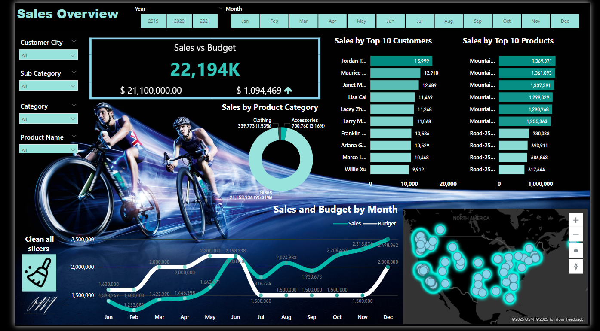
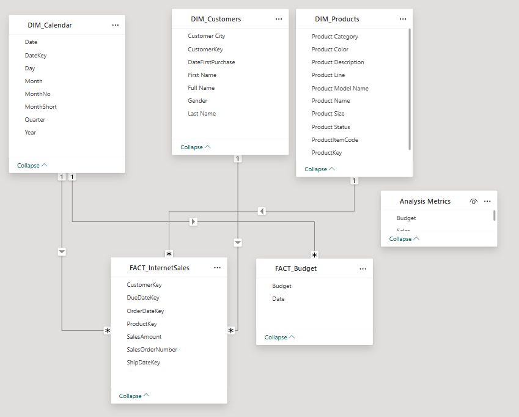

# 🚀 Power BI Dashboard – Sales Performance & Budget Tracking

## 📊 Project Overview

This dynamic and interactive **Power BI dashboard** was built to empower the sales team with actionable insights. Based on real business needs and user stories, the dashboard provides a comprehensive view of **internet sales performance**, **top products**, **key customers**, and **budget comparison** over time.

It is designed for both **sales managers** and **representatives** to monitor KPIs, identify trends, and make data-driven decisions.

---

## 🎯 Objectives

- Analyze monthly internet sales vs. budget
- Identify top 10 customers and top 10 products
- Monitor performance by product category and customer city
- Enable filtering by year, month, product, category, and location
- Support strategic follow-ups and forecasting

---

## 🧠 Data & Architecture

- 🔗 **Data Source:** SQL Server (raw sales data and customer/product tables)
- 📥 **Budget Data:** Excel files imported and merged using Power Query
- 🧩 **Data Model:** Star schema with fact and dimension tables
- 🧮 **DAX:** Used for calculated measures, KPIs, and time intelligence
- 🔄 **Refresh Schedule:** Designed for daily data updates

> ✅ The use of **SQL Server** ensured a scalable, secure, and relational structure for querying and transforming sales data before visualizing it in Power BI.

---

## 👥 User Stories

| Role               | Request                                                  | Value Added                                                  |
|--------------------|----------------------------------------------------------|--------------------------------------------------------------|
| Sales Manager      | View internet sales and budget comparison                | Monitor sales trends and overall performance                 |
| Sales Representative | Analyze customer-level sales                             | Identify loyal buyers and upselling opportunities            |
| Sales Representative | Analyze product-level sales                              | Focus on best-sellers and optimize inventory                 |

---

## 🛠️ Tools & Technologies

- **Power BI Desktop** – data modeling and visualization
- **SQL Server** – data storage, transformation, and querying
- **Excel** – budget input and external data
- **DAX (Data Analysis Expressions)** – custom KPIs and metrics
- **Power Query** – ETL process and data cleanup

---

## 📈 Key Features

- 📅 **Monthly Sales vs. Budget Charts**
- 🏆 **Top 10 Products & Customers Visualization**
- 🌎 **Sales by Customer City & Category**
- 🔎 **Slicers for Custom Filtering (Year, Month, Product, etc.)**
- 📊 **Matrix view for detailed breakdowns**
- 🧮 **Calculated KPIs (e.g., variance vs. budget, YoY growth)**

---
## 🗺️ Data Model Diagram

The data model follows a **star schema**, optimized for performance and simplicity.  
It includes a central fact table with related dimension tables to support filtering and slicing.

## ✨ Results & Impact

- Enhanced sales visibility across the organization
- Enabled strategic decision-making and follow-up
- Improved alignment with sales goals and budget performance
- Delivered self-service analytics to sales teams

---

## 📚 Learnings

During the development of this project, I strengthened several key skills:

- Writing advanced SQL queries to extract and prepare raw sales data from SQL Server.
- Building a star schema model and optimizing data relationships in Power BI.
- Creating dynamic and responsive DAX measures for custom KPIs and variance analysis.
- Designing clean, interactive visual reports that balance usability and business value.
- Managing multiple data sources (SQL Server + Excel) and merging them effectively.
- Understanding the practical needs of business users and converting them into BI solutions.

---

## 🔗 Files

- 📄 [User Stories Document](./Business%20Demand%20Overview%20&%20User%20Stories.docx)
- 📘 [Portfolio Report (PDF)](./Data_analyst_portfolio_Project_Patricia.pdf)

---

> 💡 _"Transforming raw SQL data into insights that drive results."_
